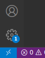
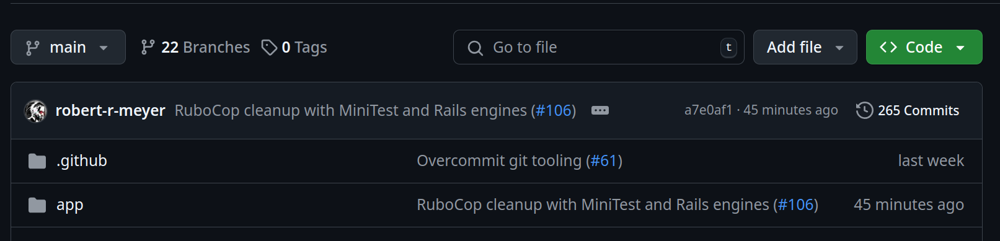
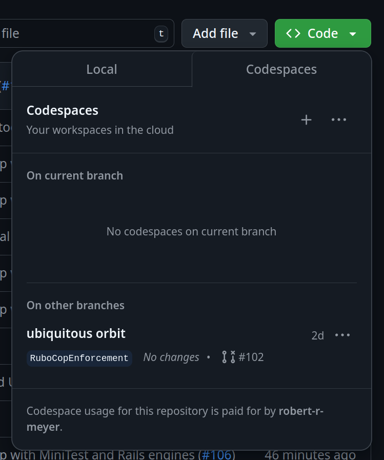

# README

## Contributing
Volunteers are welcome.

## System
Ruby on Rails 7 running with Postgres DB


## Install


### DevContainer Install
Download [VsCode](https://code.visualstudio.com/download)

- Clone repo from git.
- Open in VsCode.
- File -> Open Folder
- Select your cloned location.
- In the bottom left select the blue arrows

- Select "Reopen in container" from the dropdown.
- Install overcommit by running `overcommit` at the root. This will run automatically from then on.
- Start Developing

### GitHub CodeSpace Install
Navigate to [LooseEnds](https://github.com/looseendsproject/webapp)
- Click on the green Code button:

- Next to the word Codespaces click on the plus symbol:

- Install overcommit by running `overcommit` at the root. This will run automatically from then on.
- Start Developing


## Running Instructions
Clone repo from git and start the Rails app as usual.
- Bundle: `bundle`
- Create the database: `rails db:create`
- Load the Schema: `rails db:schema:load`
- Seed the database (optional): `rails db:seed`
- Install js dependencies: `yarn install`
- Start the dev server: `bin/dev`
- create yourself a user through the UI, then set `role = 'admin'` manually in your database


## Running Tests
Run the test suite with `rake test`

## Getting development Data
Data can be pulled from Heroku.

Get the google api key from another developer to render maps and geocode objects.

## Starting the App
```
bin/dev
```

## Tests
In progress with GitHub actions requiring tests to pass